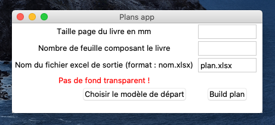

# Pliure (book folding) Art

> :construction_worker: This Git repository is still under heavy construction 

## Explanations :

>  :bulb: What is Folded Book Art : 
> Pliure is the fact of folding every page of a book in order to make an image appear. 
> Those plans are however usually expensive.
>
>

Well this code is the solution :bulb: :
 
It generates an excel spreadsheet with folding measurements.
 
 It is really easy just feed the program with a
 B&W image and it will generate the perfectly adapted plan !

---

Made with :heart: in Grenoble !

